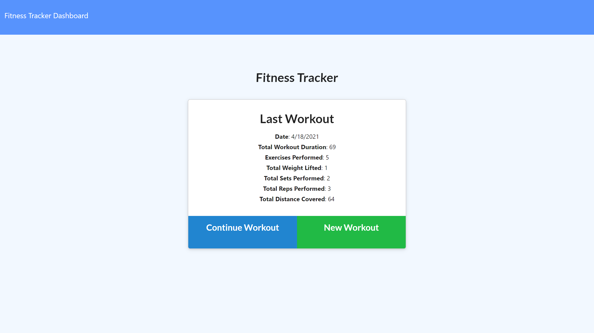
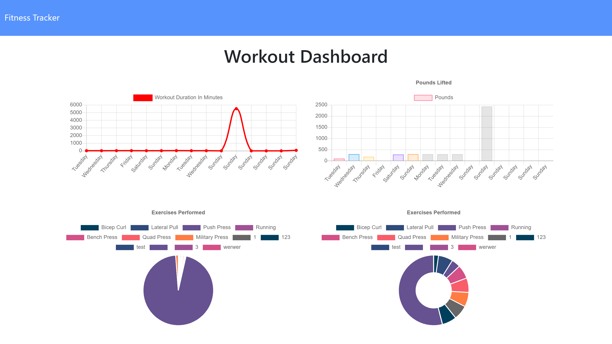

# NoSQL Fitness Tracker

This project is a practice on using a NoSQL database, in this case MongoDB's cloud service Atlas. With a prebuilt front-end, this project allows users to enter in their workout to keep track of their daily exercise. Users can see their weekly progress through the dashboard which provides two charts that tracks the user's cardio and resistence training.

[Live Link](https://secure-plains-45963.herokuapp.com/)

## Table of Contents
* [Usage](#usage)
* [Contributors](#contributors)
* [Questions](#questions)
* [License](#license)

# Usage
To use the program, go to this link (https://secure-plains-45963.herokuapp.com/) in a modern web browser and start entering your workout data to keep track.

# Contributors
Thanks to the following people who have contributed to this project:

* [Scott Byer](https://github.com/switch120) 
* [Mike Fearly](https://michaelfearnley.com/)
* UNH Full Stack Development Bootcamp

# Questions
You can find me at my [github page here](https://github.com/ejhuang2015).
Any comments, questions, or concerns? Email me  at ejhuang.2015@gmail.com.

# License
### Copyright (c) [2021] [ejhuang2015]
View the license in [license.txt](./license.txt)